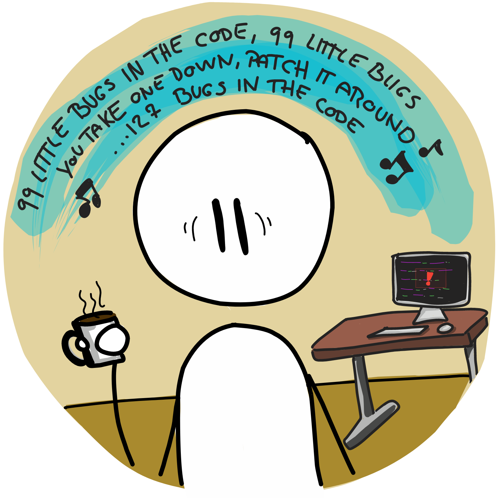
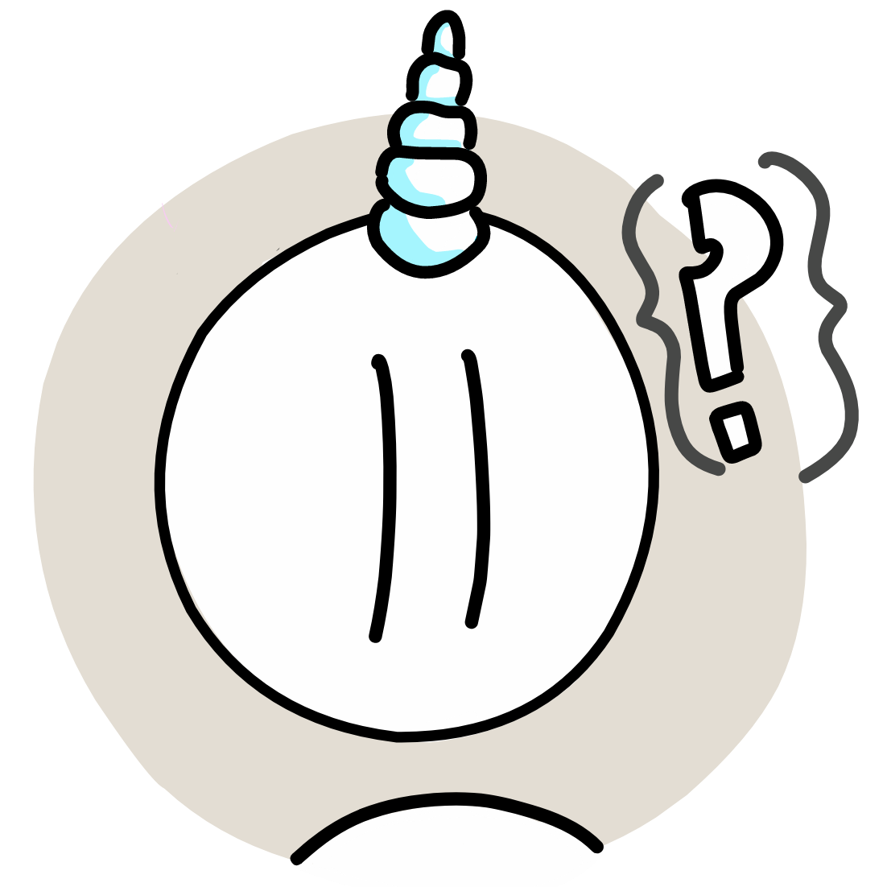
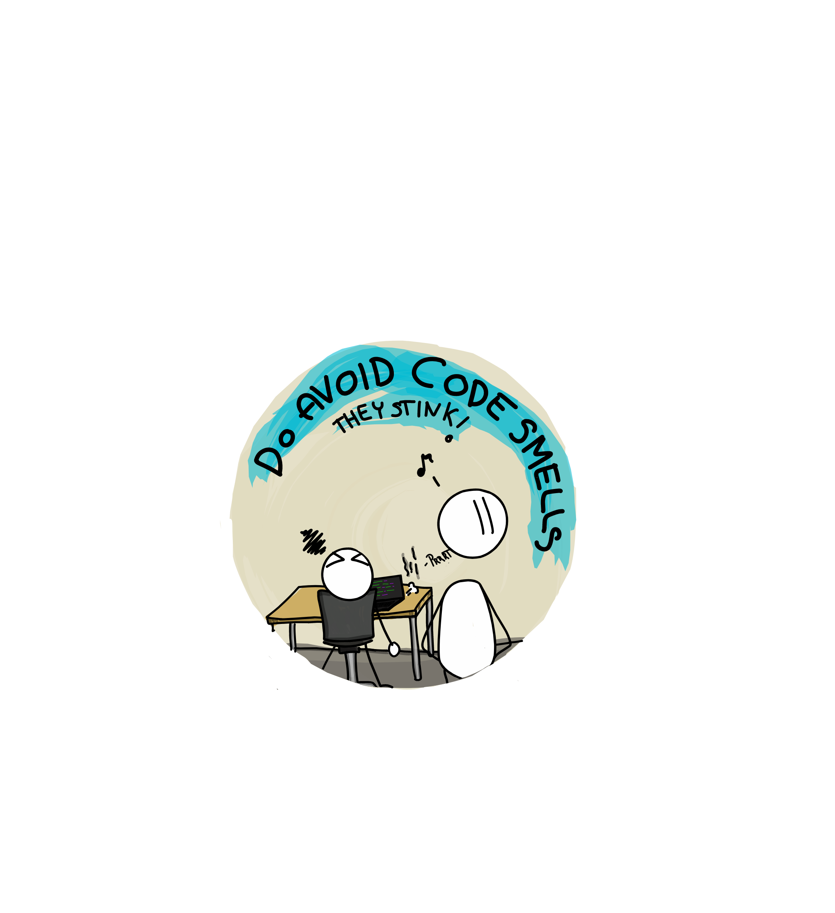

# pictoProgrammer
A repository of my doodles inspired by the life of a programmer. 

*I will have the images at a more samesized/samenamed format at some point*

**When the going gets tough..**

**When you finally solve the bugs..**

**When the code smells..**

